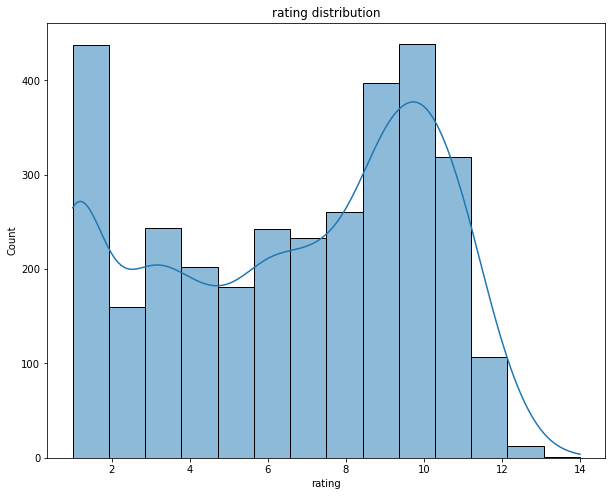
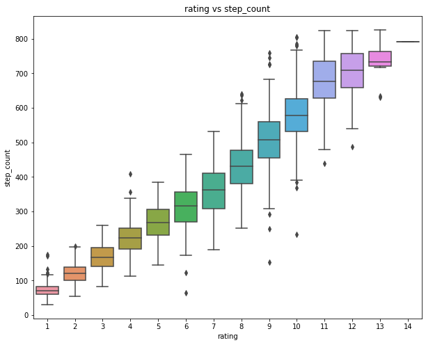
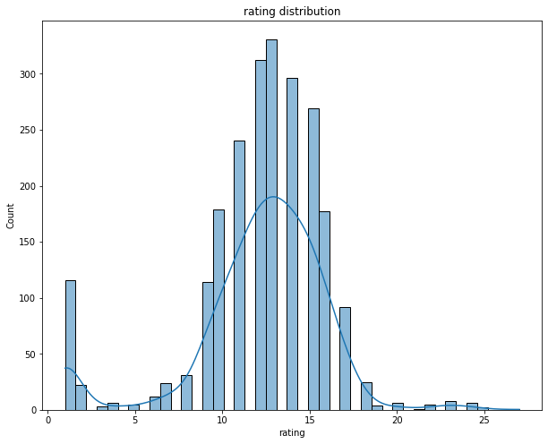
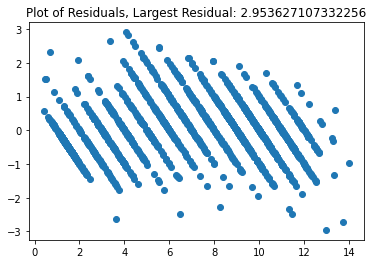
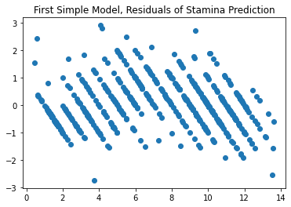
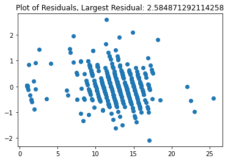
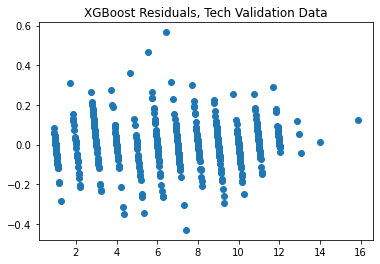
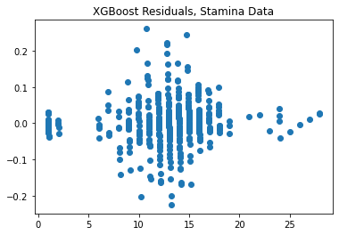
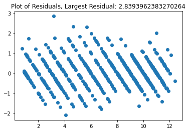
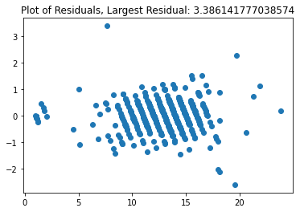

# Predicting StepMania Song Difficulty Using Regression  

by [Svitlana Glibova](mailto:s.glibova@gmail.com)

  
photo by cottonbro from Pexels  


## Introduction  
### About StepMania  
Stepmania is an open-source software designed to support many styles of rhythm game play, but one of its most widely-used formats is for 4-panel “dance games” (like Dance Dance Revolution or In The Groove, but not licensed). The software was released in 2001 and has since been updated through version 5.3 - the concept behind this software is to allow players to play a “DDR-like” game with virtually boundless customizations, including custom themes, statistics, and charts (arrow patterns for songs).  

### Problem  
There is not currently a standardized scale or model for determining chart difficulty being used within the community, leaving the determination up to step-artist and community input. While extensive domain experience means that chart ratings are relatively consistent, there is variance that can be addressed.

### Proposal  
The problem that I aim to solve is using exploratory data analysis and predictive modeling to help establish a standardization for song chart difficulty ratings based on various features of the chart, such as BPM, number of steps, and counts of technical elements.

### Motivation  
Creating a method of standardization will help examine which features are the most important in determining difficulty and help
step-artists remove the intuitive/guesswork element from rating their own charts. 

## Data  
### Collection  

[itgpacks.com](www.itgpacks.com) is a community-maintained spreadsheet containing the majority of song packs released in the last five years. The majority of this data came from here, with the exception of a few packs downloaded from other sources.   

The data is extracted from each individual song file using a parser written in Python to collect the features used for EDA and predictive modeling. A huge, huge, huge thank you to Tim Murphy, a friend and dance game player, for writing the code for this parser. You can check out their [GitHub here.](https://github.com/JaceTSM/).  


### Folder Structure    
The data is stored in `data` in two folders: `stam.csv` and `not_stam.csv`.
Please keep the folder structure the same way for this notebook to work. If you would like to include your own song files, you can visit [this Github Repo](https://github.com/JaceTSM/sm_tools) 
for the code to run a parser over your own song files. To use:  
```
python src/python/step_parser.py path/to/your/songfiles path/to/data/yourfile.csv
```
Make sure you have the .csv file in `data` and in the notebook, change the path to look like this:  
```
your_dataframe = pd.read_csv('yourfile.csv')
```

The rest of the notebook must then use the ```your_dataframe``` variable from here on out.

### Song Features  
[Here](data/feature_dictionary.txt) you can find a full list of each generated feature and a a brief description.  

## Methods  
### EDA / Visualizations  
Distribution of tech data difficulties:  
  
The difficulty values here have a smaller distribution than that of the stamina data below. For this reason, it seemed important to preserve the distinction with two datasets.  
Relationship of step count vs rating for tech data:  
  
There is a much more linear relationship with the tech data than with stamina because stamina has a much broader step count distribution as well.  

Stamina difficulty distribution:  
  

Relationship of step count vs. rating for stamina data (note that there are very few songs in the upper difficulties, which skewed the correlation):  


### First Simple Model  
  
Using simple linear regression on scaled data as a first simple model was surprisingly successful, as the residual plot above illustrates.  
R-squared values hovered around .95, but a few of the residuals (true value minus predicted value) were too large to be considered accurate.  

### Iterative Model Building
### Ridge Regression With Low Regularization:
Residuals for tech data:  
  

Residuals for stamina data:  
  

Using ridge regression with a lower regularization values (alpha = .1 to alpha = .3) increased the model's R-squared as well as facilitated feature extraction.  
With scaling, power transform, and ridge regression, the mean R-squared was approximately .962 and below are the largest coefficients extracted from the data.  
Tech:  
`step_count`    
`song_nps`   
`nps_per_measure_max`    
`nps_per_measure_avg` - surprisingly, this coefficient was negatively correlated.     
`nps_per_measure_std`  

Stamina:  
`step_count`    
`measure_count` - negative correlation, but potentially explained as a relationship to density as challenging songs tend to be more dense but aren't necessarily longer.   
`song_nps`    
`nps_per_measure_max`    
`nps_per_measure_std`    
`stream_total`  

### Untuned XGBoost Regressor:
      
Using the XGBoost regression algorithm alone drastically increased the training R-squared scores to over .99, but showed some overfitting with the validation set.  
    
Feature extraction proved to be slightly more challenging with this model but NPS still proved to be consistently important across both datasets.    

## Final Model  
Technical:  
  

Train R^2: 0.9905622716862734   
Test R^2: 0.9682993868229007  
Train MSE: 0.11507272737720832    
Test MSE: 0.4042809100762739  

Stamina:  
  

Train R^2: 0.9921925792873305   
Test R^2: 0.9792039976085652  
Train MSE: 0.11570726800700412   
Test MSE: 0.28227917653038775    


## Results / Conclusions
The final model was able to accurately predict on validation data with minimal error, although it looks like there was some challenge with higher-level difficulties for stamina data (most likely due to there being fewer data in this realm), and due to the variance of the technical data.  
There was some slight overfitting with both datasets, but the R-Squared values did not differ significantly from training to test sets.  


## Next Steps  
To continue this project, I aim to collect more song data and potentially re-train the model with more information, although the key features are unlikely to change. I also intend to tune a classifier model beyond the initial EDA stage.
The immediate next step will be to deploy this model using Flask, which this README will be updated to include.  


### Repo Structure  
```
├── app - contains WIP Flask application and folders
├── data
  ├── feature_dictionary.txt
  ├── not_stam.csv
  └── stam.csv
├── img     
├── notebooks  
  ├──eda_notebook.ipynb
  └──model_testing.ipynb 
├── src
  ├── models
    ├── tech_model.pkl
    └── stam_model.pkl
  ├── visualizer.py   
  └── data_cleaning.py  
├── final_notebook.ipynb  
├── README.md
├── sm_model_env.yml
└── presentation.pdf - contains a non-technical presentation of the findings 
```

### Acknowledgements / Sources
A huge thank you to the creators of [Stepmania](https://github.com/stepmania) and to quietly-turning and hurtpiggypig for the [Simply Love Theme](https://github.com/Simply-Love/Simply-Love-SM5) for creating and maintaining this software, as well as all contributing stepartists for the data used in this project.